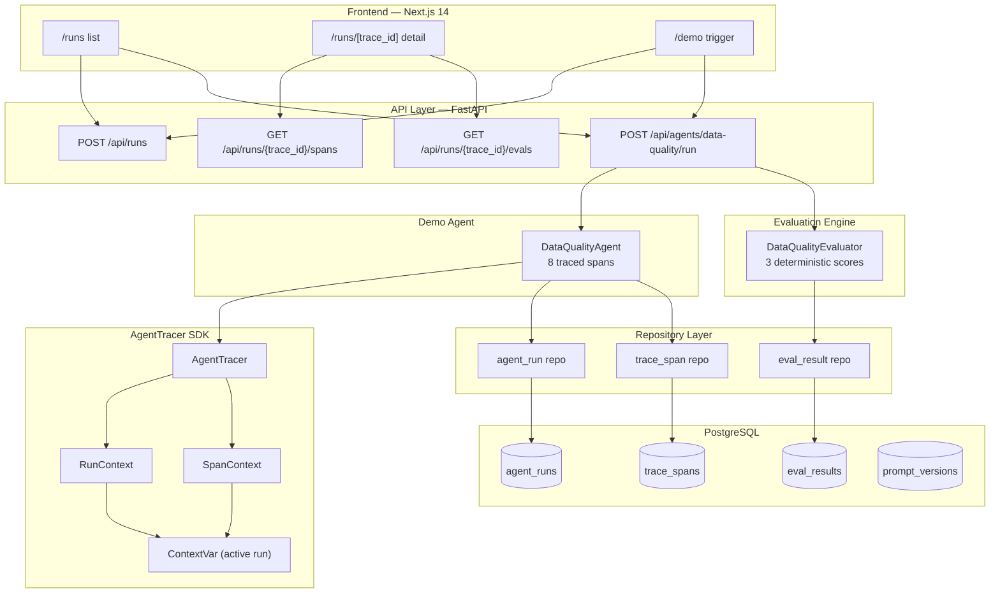
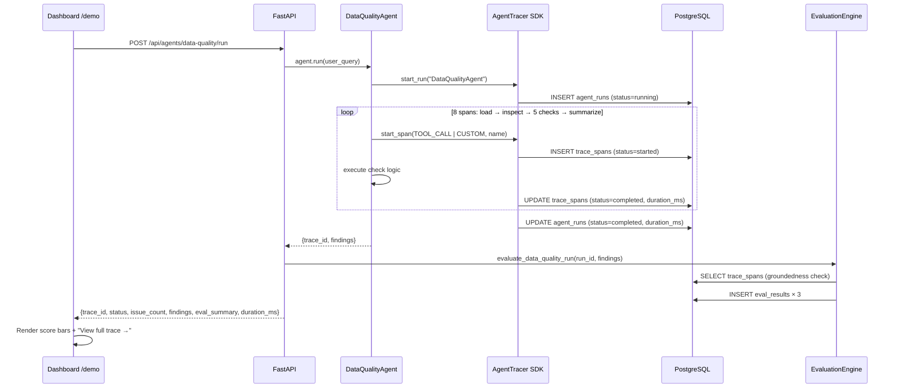

# AgentOps Control Plane

> A production-oriented observability, evaluation, and tracing platform for enterprise AI agents — built with FastAPI, PostgreSQL, a custom in-process tracing SDK, and a Next.js dashboard.

---

## What This Demonstrates

This project is a portfolio piece that shows end-to-end full-stack engineering for AI agent infrastructure. Specific skills evidenced:

| Area | What the code shows |
|------|---------------------|
| **Systems design** | Clean layered architecture: API → Repository → ORM → Database, with a separate SDK layer for in-process tracing |
| **Python backend** | FastAPI, SQLAlchemy 2.0, Alembic migrations, Pydantic V2, pytest with SAVEPOINT-based test isolation |
| **Custom SDK** | `AgentTracer` — a Python context-manager SDK using `contextvars.ContextVar` for thread-safe, re-entrant run tracking |
| **Evaluation framework** | Deterministic, LLM-free evaluation engine that scores agent outputs against ground-truth span data |
| **Frontend engineering** | Next.js 14 App Router, TypeScript, Tailwind CSS, typed REST client, interactive Gantt-style trace timeline |
| **Software quality** | 39 pytest tests, 0 warnings, strict TypeScript, clean `tsc` + `next build` |

---

## Why AgentOps?

As AI agents move into production, engineering teams face three hard problems:

1. **Observability** — What did the agent actually do? Which tool call took 4 seconds? Where did it fail?
2. **Evaluation** — Was the output correct? How grounded were the findings? How do we catch regressions?
3. **Reproducibility** — Can we replay a run from a specific prompt version and compare results?

This project implements the first two layers of that stack: trace persistence and deterministic evaluation. It is designed around the same conceptual model as OpenTelemetry (runs → spans → metadata), adapted for AI agent workflows.

---

## Architecture



---

## Demo Run — Sequence Diagram



---

## Feature Highlights

### Backend
- **AgentTracer SDK** — lightweight Python SDK for instrumenting agent code with `with tracer.start_run() / start_span()` context managers
- **Trace persistence** — every run and span (name, type, status, input, output, error, `duration_ms`) is written to PostgreSQL via SQLAlchemy
- **8 SpanType values** — `LLM_CALL`, `TOOL_CALL`, `RETRIEVAL`, `EVALUATION`, `HANDOFF`, `GUARDRAIL`, `ERROR`, `CUSTOM` (Pydantic-validated enum)
- **Evaluation engine** — deterministic scoring with no LLM-as-judge dependency: `issue_detection_score`, `groundedness_score`, `hallucination_risk_score`
- **Clean architecture** — API layer → Repository layer → ORM models → Database, each independently testable
- **Alembic migrations** — hand-written migration for all 4 tables with proper indexes and FK constraints
- **39 tests, 0 warnings** — SQLite in-memory tests with SAVEPOINT isolation so `session.commit()` inside repositories doesn't break test rollbacks

### Frontend
- **Runs list** (`/runs`) — live table with status badges, duration, agent name
- **Run detail** (`/runs/[trace_id]`) — eval score bars, interactive Gantt-style span timeline, click-to-inspect span JSON
- **Demo trigger** (`/demo`) — one-button agent execution with instant results panel and link to the persisted trace
- **Typed API client** — `lib/api.ts` with full TypeScript interfaces for all response shapes

---

## Tech Stack

| Layer | Technology |
|-------|-----------|
| **API framework** | FastAPI 0.100+ (Python 3.11) |
| **ORM** | SQLAlchemy 2.0 (Session API) |
| **Migrations** | Alembic |
| **Validation** | Pydantic V2 |
| **Database** | PostgreSQL 16 (production), SQLite in-memory (tests) |
| **Testing** | pytest, FastAPI `TestClient` |
| **Frontend framework** | Next.js 14 (App Router) |
| **Styling** | Tailwind CSS |
| **Frontend language** | TypeScript (strict mode) |
| **Container runtime** | Docker + Docker Compose |

---

## Project Structure

```
agentops-control-plane/
├── backend/
│   ├── main.py                          # FastAPI app entry point
│   ├── config.py                        # Pydantic Settings (env vars)
│   ├── requirements.txt
│   ├── api/
│   │   ├── routes.py                    # GET /health
│   │   ├── runs.py                      # /api/runs + /spans + /evals endpoints
│   │   └── agents.py                    # POST /api/agents/data-quality/run
│   ├── app/
│   │   ├── tracing/tracer.py            # AgentTracer SDK (ContextVar, RunContext, SpanContext)
│   │   ├── agents/data_quality_agent.py # DataQualityAgent with 8 traced spans
│   │   └── evals/data_quality_evaluator.py  # 3 deterministic evaluation scores
│   ├── models/                          # SQLAlchemy ORM models
│   │   ├── agent_run.py
│   │   ├── trace_span.py
│   │   ├── eval_result.py
│   │   └── prompt_version.py
│   ├── schemas/                         # Pydantic request / response schemas
│   │   ├── enums.py                     # SpanType enum
│   │   └── ...
│   ├── repositories/                    # Thin data-access wrappers
│   │   ├── agent_run.py
│   │   ├── trace_span.py
│   │   └── eval_result.py
│   ├── db/database.py                   # SQLAlchemy engine + session factory
│   ├── alembic/                         # Database migrations
│   │   └── versions/0001_initial_schema.py
│   ├── sample_data/payments.csv         # Demo dataset with 5 intentional defects
│   └── tests/
│       ├── conftest.py                  # Fixtures: in-memory SQLite + SAVEPOINT isolation
│       ├── test_health.py
│       ├── test_models.py
│       ├── test_api_runs.py
│       ├── test_tracer.py
│       ├── test_data_quality_agent.py
│       └── test_evals.py
├── frontend/
│   ├── app/
│   │   ├── layout.tsx                   # Nav shell
│   │   ├── demo/page.tsx                # Agent trigger page
│   │   ├── runs/page.tsx                # Runs list
│   │   └── runs/[trace_id]/page.tsx     # Run detail: timeline + evals
│   └── lib/api.ts                       # Typed REST client
├── Dockerfile                           # Backend image
├── frontend/Dockerfile                  # Frontend image
├── docker-compose.yml                   # PostgreSQL + Backend + Frontend
└── .env.example
```

---

## Quick Start

### Prerequisites

- Python 3.11+
- Node.js 20+
- Docker & Docker Compose

### 1. Clone and set up Python environment

```bash
git clone https://github.com/pjwan2/AGENTS_CONTROL_PLANE.git
cd AGENTS_CONTROL_PLANE

python -m venv venv
# Windows PowerShell:
.\venv\Scripts\Activate.ps1
# macOS / Linux:
# source venv/bin/activate

pip install -r backend/requirements.txt
```

### 2. Configure environment

```bash
cp .env.example .env
# Edit .env if you need non-default DB credentials
```

### 3. Start the backend (with Docker)

```bash
# Start PostgreSQL + FastAPI in one command
docker-compose up -d postgres backend

# Apply database migrations
docker-compose exec backend alembic -c backend/alembic.ini upgrade head

# Tail backend logs
docker-compose logs -f backend
```

The API is now at **http://localhost:8000** — Swagger UI at **http://localhost:8000/docs**

### 4. Start the frontend

```bash
cd frontend
npm install        # first time only
npm run dev        # → http://localhost:3000
```

### 5. Run the demo

Open **http://localhost:3000/demo**, click **"Run Data Quality Agent"**, then follow the link to the trace detail page.

Or via curl:

```bash
curl -s -X POST http://localhost:8000/api/agents/data-quality/run \
  -H "Content-Type: application/json" \
  -d '{"user_query": "Check payment data quality"}' | python -m json.tool
```

### 6. Run tests (backend)

```bash
# From repo root with venv active
pytest backend/tests/ -v
# 39 passed, 0 warnings
```

---

## Dashboard Screenshots

> **`/demo` — Agent trigger and results panel**
>
> Shows a "Run Data Quality Agent" button. After running, displays: trace ID, status, issue count, duration, eval score bars (issue_detection · groundedness · hallucination_risk), and findings JSON. Links directly to the trace detail page.
>
> *Start the frontend (`npm run dev`) to see the live UI at `http://localhost:3000/demo`.*

---

> **`/runs` — Agent run list**
>
> Paginated table of all recorded agent executions with trace ID (truncated, clickable), agent name, colour-coded status badge, duration in ms, and ISO start time.

---

> **`/runs/[trace_id]` — Trace detail**
>
> Four sections: run metadata stats · eval score progress bars · interactive Gantt-style span timeline (click any bar to inspect input/output JSON) · span detail panel.

---

## API Reference

### Health

| Method | Path | Description |
|--------|------|-------------|
| `GET` | `/health` | System health and database connectivity |

### Agent Runs

| Method | Path | Description |
|--------|------|-------------|
| `POST` | `/api/runs` | Create a run record |
| `GET` | `/api/runs` | List all runs (`?skip=&limit=`) |
| `GET` | `/api/runs/{trace_id}` | Get a run by trace ID |
| `POST` | `/api/runs/{trace_id}/spans` | Add a span to a run |
| `GET` | `/api/runs/{trace_id}/spans` | List all spans for a run |
| `GET` | `/api/runs/{trace_id}/evals` | List eval results for a run |

### Demo Agent

| Method | Path | Description |
|--------|------|-------------|
| `POST` | `/api/agents/data-quality/run` | Run DataQualityAgent end-to-end |

#### Example: full demo run

```bash
# Trigger a run
RESULT=$(curl -s -X POST http://localhost:8000/api/agents/data-quality/run \
  -H "Content-Type: application/json" \
  -d '{"user_query": "Audit payments"}')

TRACE_ID=$(echo $RESULT | python -c "import sys,json; print(json.load(sys.stdin)['trace_id'])")

# Inspect spans
curl -s http://localhost:8000/api/runs/$TRACE_ID/spans | python -m json.tool

# Inspect eval scores
curl -s http://localhost:8000/api/runs/$TRACE_ID/evals | python -m json.tool
```

#### Response shape — `POST /api/agents/data-quality/run`

```json
{
  "trace_id": "550e8400-e29b-41d4-a716-446655440000",
  "status": "completed",
  "issue_count": 5,
  "duration_ms": 12,
  "findings": {
    "schema": ["transaction_id", "amount", "currency", "payment_date", "settlement_date"],
    "duplicate_transaction_ids": ["TXN001"],
    "null_settlement_dates": ["TXN003"],
    "negative_amounts": ["TXN004"],
    "invalid_currencies": ["TXN005"],
    "future_payment_dates": ["TXN006"],
    "summary": { "total_rows": 7, "total_issues": 5, "checks_passed": false }
  },
  "eval_summary": {
    "issue_detection_score": 1.0,
    "groundedness_score": 1.0,
    "hallucination_risk_score": 0.0
  }
}
```

---

## Evaluation Metrics

All three scores are computed deterministically from the agent's findings dict and the span outputs already persisted in the database. No LLM calls are made during evaluation.

### `issue_detection_score` — *correctness*

> **"Did the agent find all the issue categories it was supposed to find?"**

Fraction of expected issue categories (`duplicate_transaction_ids`, `null_settlement_dates`, `negative_amounts`, `invalid_currencies`, `future_payment_dates`) that have at least one entry in the findings dict.

- **1.0** — all five categories detected
- **0.6** — three of five detected
- **Higher is better**

### `groundedness_score` — *correctness*

> **"Are the agent's reported findings actually backed by what the check spans produced?"**

For each of the five check spans, the span's `output_data` (a JSON list of transaction IDs) is compared with the corresponding entry in the findings dict. Score = fraction of spans where the two lists match exactly.

- **1.0** — every finding is backed by its source span
- **0.0** — all findings diverge from span outputs (possible data corruption)
- **Higher is better**

### `hallucination_risk_score` — *safety*

> **"Did the agent report issues that no span actually found?"**

Fraction of reported issue items that do NOT appear in any span's output. Measures whether findings were fabricated rather than derived from actual check logic.

- **0.0** — no hallucinations, all reported items are span-sourced
- **1.0** — all reported items are unsupported
- **Lower is better**

---

## AgentTracer SDK — Quick Reference

```python
from sqlalchemy.orm import Session
from backend.app.tracing import AgentTracer
from backend.schemas.enums import SpanType

def run_agent(db: Session) -> None:
    tracer = AgentTracer(db=db)

    with tracer.start_run("PlannerAgent", user_query="Plan a trip to Tokyo") as run:
        print(f"trace_id: {run.trace_id}")

        with tracer.start_span(SpanType.LLM_CALL, "outline_trip", input="Tokyo trip") as span:
            result = "Day 1: Shinjuku, Day 2: Shibuya"   # real LLM call here
            span.set_output(result)
            span.set_metadata({"model": "gpt-4o", "prompt_tokens": 120})

            # Nested span
            with tracer.start_span(
                SpanType.RETRIEVAL, "web_search",
                input="Tokyo attractions",
                parent_span_id=span.span_id,
            ) as child:
                child.set_output(["Senso-ji", "Shibuya Crossing"])
```

### What gets recorded automatically

| Field | When |
|-------|------|
| `started_at` | ORM default on row creation |
| `completed_at` / `ended_at` | Set on context-manager `__exit__` |
| `duration_ms` | Computed from start → end |
| `status` | `"completed"` on clean exit, `"failed"` on exception |
| `error_message` | Populated from the raised exception or `span.set_error()` |

### SpanType enum

| Value | Use for |
|-------|---------|
| `LLM_CALL` | Language model inference |
| `TOOL_CALL` | External tool or function invocation |
| `RETRIEVAL` | Vector search or document fetch |
| `EVALUATION` | Scoring or grading step |
| `HANDOFF` | Agent-to-agent delegation |
| `GUARDRAIL` | Safety or policy check |
| `ERROR` | Explicit error capture |
| `CUSTOM` | Anything that doesn't fit above |

---

## Data Models

### AgentRun
Tracks one end-to-end agent execution.

| Field | Type | Notes |
|-------|------|-------|
| `trace_id` | UUID string | Globally unique, returned to callers |
| `agent_id` | string | Agent instance identifier |
| `agent_name` | string | Human-readable name |
| `status` | enum | `pending \| running \| completed \| failed` |
| `input_data` | JSON text | Serialised inputs (user_query, model, etc.) |
| `output_data` | JSON text | Serialised final output |
| `error_message` | text | Error detail if failed |
| `started_at` | datetime | UTC, set by ORM default |
| `completed_at` | datetime | UTC, set on exit |
| `duration_ms` | integer | Wall-clock time in ms |

### TraceSpan
One unit of work within a run (tool call, LLM call, retrieval, etc.).

| Field | Type | Notes |
|-------|------|-------|
| `agent_run_id` | FK → agent_runs | Parent run |
| `parent_span_id` | FK → trace_spans | For nested spans |
| `span_name` | string | Descriptive step name |
| `span_type` | SpanType enum | Stored as string |
| `status` | enum | `started \| completed \| failed` |
| `input_data` | JSON text | Input + metadata merged |
| `output_data` | text | Span output (raw or JSON) |
| `duration_ms` | float | Sub-millisecond precision |
| `token_count` | integer | LLM token consumption |

### EvalResult
One evaluation score for a run.

| Field | Type | Notes |
|-------|------|-------|
| `agent_run_id` | FK → agent_runs | Parent run |
| `eval_name` | string | e.g. `issue_detection_score` |
| `eval_type` | string | `correctness \| safety \| efficiency` |
| `score` | float [0, 1] | Higher is better (except `hallucination_risk`) |
| `meta_data` | JSON text | Additional context |

---

## Development Workflow

### Adding a new agent

1. Create `backend/app/agents/my_agent.py` with a class that takes `db: Session`
2. Instrument it with `AgentTracer` context managers and `SpanType` values
3. Add a POST endpoint in `backend/api/agents.py`
4. Write tests in `backend/tests/test_my_agent.py` using `test_db_session` fixture

### Adding a new evaluator

1. Create `backend/app/evals/my_evaluator.py`
2. Implement `evaluate_my_run(db, run_id, findings) -> list[EvalResult]`
3. Call `eval_repo.create(db, EvalResultCreate(...))` for each metric
4. Wire it into the agent's API endpoint

### Database migrations

```bash
# Create a new migration (from repo root, venv active)
alembic -c backend/alembic.ini revision --autogenerate -m "add my_table"

# Apply
alembic -c backend/alembic.ini upgrade head

# Rollback one step
alembic -c backend/alembic.ini downgrade -1
```

---

## Roadmap

These are planned features — not yet implemented:

- [ ] **Authentication & multi-tenancy** — API key authentication, project-scoped runs
- [ ] **Replay** — Re-execute a run from its persisted inputs and compare outputs
- [ ] **Prompt versioning** — Track prompt templates against run outcomes (`PromptVersion` model already exists)
- [ ] **LLM-as-judge evaluation** — Optional GPT-4 scoring layer on top of deterministic evals
- [ ] **OpenTelemetry export** — Push spans to Jaeger / Grafana Tempo
- [ ] **Streaming ingestion** — Accept spans via WebSocket for real-time timeline updates
- [ ] **CI/CD** — GitHub Actions: pytest + tsc + docker build on every PR
- [ ] **Production deployment** — Cloud Run / ECS with managed Postgres

---

## Engineering Notes

### Why `join_transaction_mode="create_savepoint"` in tests?

Repository functions call `session.commit()` to flush writes immediately (so `db.refresh()` works). In tests, we wrap each test in a transaction that rolls back on teardown. Without SAVEPOINT mode, `session.commit()` would commit the *outer* transaction and teardown's `rollback()` would fail. SAVEPOINT mode makes `commit()` release a savepoint instead, preserving the outer rollback.

### Why `ContextVar` in AgentTracer?

`ContextVar` is Python's standard mechanism for task-local state that is safe across threads and async tasks. Using a plain module-level variable would cause cross-thread state bleed when the FastAPI server handles concurrent requests. `ContextVar` ensures each request's tracer sees only its own active run.

### Why hand-written Alembic migrations?

Autogenerate (`--autogenerate`) requires a live database connection during development. Hand-written migrations work offline and are easier to review in code review since the intent is explicit rather than derived.

---

## License

MIT

---

## Contact

Built by **Pengju Wang** — [GitHub](https://github.com/pjwan2)
